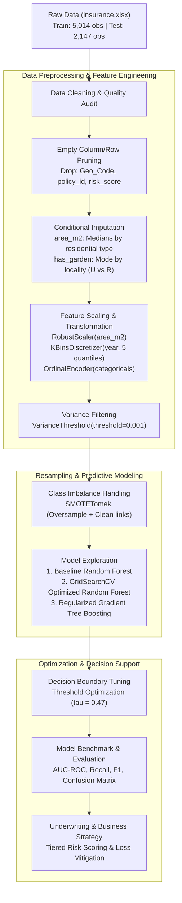

# Carthage Insurance - Supervised ML Predictive Model

[](https://www.python.org/)
[](https://scikit-learn.org/)
[](https://imbalanced-learn.org/)
[](https://pandas.pydata.org/)
[](https://jupyter.org/)
[]()

---

### Project Metadata
- **Timeline:** January 2026
- **Context:** Academic Machine Learning Project @ Institut International de Technologie (IIT)
- **Author:** Moataz Triki *(in collaboration with Zouhour Ameur, Melek Rekik, Ons Yangui)*
- **Supervision:** Pr. Taoufik Ben Abdallah & Pr. Tarek Ben Said — Department of Computer Engineering (GLID)

---

## Overview

Developed a supervised machine learning predictive model for Carthage Insurance to analyze risk factors and optimize data-driven decision-making.

In the competitive insurance landscape, accurate risk estimation is critical for underwriting profitability, policyholder retention, and proactive claims management. This project develops an end-to-end supervised machine learning pipeline on real-world housing insurance policy data from **Carthage Assurances** (*Train partition: 5,014 contracts; Test partition: 2,147 contracts*). The objective is to forecast the probability of a policyholder filing an insurance claim (`claim` binary target), enabling risk-stratified underwriting, automated premium adjustments, and targeted loss prevention.

---

## Key Contributions

- **Trained and evaluated robust predictive models using Scikit-Learn to accurately assess insurance risks.**
- **Performed comprehensive exploratory data analysis and feature engineering to maximize model performance.**
- **Designed streamlined ML pipelines to process structured tabular data and generate actionable business insights.**

---

## System Architecture



---

## Tech Stack

| Domain | Technologies & Libraries | Purpose |
| :--- | :--- | :--- |
| **Core Language** | `Python 3.10+` | Primary programming language for data pipelines and modeling |
| **Data Manipulation** | `Pandas`, `NumPy`, `OpenPyXL` | High-performance tabular transformation and multi-sheet Excel ingestion |
| **Machine Learning** | `Scikit-Learn` | Preprocessing estimators, tree models, hyperparameter grid search, evaluation |
| **Imbalanced Learning**| `Imbalanced-Learn (imblearn)` | `SMOTE` and `SMOTETomek` synthetic oversampling & border cleaning |
| **Statistical Analysis**| `SciPy` | Distribution analysis, variance thresholding, and metric computation |
| **Visualization** | `Matplotlib`, `Seaborn` | Exploratory data visualization, correlation matrices, ROC curves, confusion matrices |
| **Interactive Research**| `Jupyter Notebooks` | Iterative experimentation, model explainability, and validation |

---

## Dataset & Exploratory Data Analysis (EDA)

The Carthage Insurance dataset contains residential policy records split into training and testing partitions:
- **Training partition:** 5,014 observations, 13 initial attributes
- **Testing partition:** 2,147 observations, 13 initial attributes
- **Target Variable:** `claim` (Binary: `0` = No insurance claim, `1` = At least one claim filed)

### Feature Schema & Actuarial Descriptions

| Feature | Type | Actuarial Description |
| :--- | :--- | :--- |
| `policy_id` | Identifier | Unique policy contract identification key *(dropped during preprocessing)* |
| `year` | Temporal | Observation year of building inspection |
| `coverage_period` | Continuous | Fraction of annual insurance coverage active (e.g., 1.0, 0.5) |
| `is_residential` | Binary | Residential classification (`1` = Residential property, `0` = Commercial/Other) |
| `is_finished_and_fenced` | Categorical | Structural enclosure condition (`V/V`, `V/N`, `N/V`, `N/N`) |
| `has_garden` | Categorical | Presence of property garden/vegetation (`V`, `0`) |
| `locality` | Categorical | Geographic urban/rural zoning (`U` = Urban, `R` = Rural) |
| `area_m2` | Continuous | Total constructed surface area in square meters |
| `structure_type` | Categorical | Architectural building structural classification |
| `window_count` | Categorical/Discrete | Window count (`without`, `1`–`9`, `>=10`) |
| `building_type` | Categorical | Architectural taxonomy of the housing structure |
| `claim` *(Target)* | Binary | Historical occurrence of at least one insurance claim (`0` / `1`) |

### Key EDA Insights
1. **Class Imbalance:** Negative policies outnumber positive claim events at approximately a **3.45:1** ratio in training data (3,886 negatives vs. 1,126 positives, representing a 22.47% baseline claim prevalence).
2. **Heavy-Tailed Surface Distribution:** `area_m2` exhibits positive skewness with high outliers, requiring non-parametric outlier-resilient scaling.
3. **Locality and Vegetative Coverage:** Urban environments (`locality = 'U'`) exhibit distinctive vegetative coverage compared to rural zones (`'R'`), establishing the foundation for conditional domain imputation.

---

## Advanced Feature Engineering & Pipeline Design

To ensure optimal generalizability without data leakage, the pipeline incorporates domain-tailored transformations:

### 1. Robust Missing Value Imputation
- **Conditional Median Imputation for Surface (`area_m2`):** Rather than standard global median imputation, missing values are imputed conditionally on `is_residential` status:
  - $\text{Median}(\text{area\_m2} \mid \text{is\_residential}=0) = 418.0 \text{ m}^2$
  - $\text{Median}(\text{area\_m2} \mid \text{is\_residential}=1) = 280.0 \text{ m}^2$
- **Locality-Conditioned Categorical Imputation (`has_garden`):** Imputed leveraging the cross-tabulated conditional frequency by locality (`U` $\rightarrow$ `'V'`, `R` $\rightarrow$ `'0'`).

### 2. Feature Transformations
- **`RobustScaler` for Surface (`area_m2`):** Scales using the median and Interquartile Range ($IQR$), dampening the influence of massive commercial complexes.
- **Window Count Discretization:** Mapped ordinal values (`"without"` $\rightarrow$ `0`, `">=10"` $\rightarrow$ `10`, standard integers preserved).
- **Quantile Binning for Observation Year (`year`):** Discretized into 5 quantile bins via `KBinsDiscretizer(n_bins=5, encode='ordinal')` to capture non-linear temporal risk shifts.
- **Ordinal Categorical Encoding:** Encoded multi-level categories (`structure_type`, `is_finished_and_fenced`, `locality`, `has_garden`).
- **Low-Variance Descriptor Pruning:** Filtered uninformative constants using `VarianceThreshold(threshold=0.001)`.

### 3. Imbalanced Data Resampling (SMOTETomek)
To prevent tree models from biasing toward the majority non-claim class, the training partition is balanced via **SMOTETomek**:
- **SMOTE (Synthetic Minority Over-sampling Technique):** Synthesizes minority claim examples along feature-space $k$-nearest neighbor vectors.
- **Tomek Links Removal:** Identifies and purges borderline ambiguous pairs between classes, yielding a clean, linearly separable decision boundary.

---

## Model Training, Optimization & Experimental Results

Three supervised learning architectures were systematically engineered, optimized, and benchmarked on the held-out test partition (2,147 unseen contracts):

1. **Random Forest Baseline:** Default unregularized ensemble (100 estimators).
2. **Random Forest Optimisé:** 5-fold cross-validated grid search optimizing depth, leaf purity, and split criteria (`n_estimators=200`, `max_depth=5`, `min_samples_leaf=2`, `max_features='sqrt'`).
3. **Gradient Tree Boosting + SMOTETomek + Threshold Tuning:** Regularized gradient boosting (`n_estimators=400`, `learning_rate=0.03`, `max_depth=3`, `subsample=0.9`) paired with minority-class decision threshold tuning ($\tau^* = 0.47$).

### Comprehensive Performance Benchmark

| Model Architecture | ROC-AUC | Accuracy | Precision (Claim=1) | Recall (Claim=1) | F1-Score (Claim=1) | Specificity | TN | FP | FN | TP |
| :--- | :---: | :---: | :---: | :---: | :---: | :---: | :---: | :---: | :---: | :---: |
| **Gradient Boosting + SMOTETomek (Threshold: 0.47)** *(Optimal)* | **0.7102** | **70.10%** | **40.82%** | **58.66%** | **0.4814** | **73.64%** | **1,207** | **432** | **210** | **298** |
| Random Forest Optimisé (Default $\tau=0.50$) | **0.7146** | 77.13% | 60.49% | 9.65% | 0.1664 | 98.05% | 1,607 | 32 | 459 | 49 |
| Random Forest Base (Default $\tau=0.50$) | 0.6584 | 73.27% | 41.36% | 31.10% | 0.3551 | 86.33% | 1,415 | 224 | 350 | 158 |

### Strategic Actuarial Findings
- **48.62% Boost in Claim Detection (Recall):** The optimized Gradient Boosting model with threshold tuning captured **58.66% of all true claims** (298 detected claims out of 508 total in test data), compared to only **9.65%** (49 claims) identified by standard Random Forest.
- **Cost Asymmetry Optimization:** In insurance underwriting, a False Negative (failing to identify a high-risk building that subsequently files a claim) carries severe financial loss compared to a False Positive (subjecting a lower-risk building to risk inspection or adjusted premium). Prioritizing high recall ($58.66\%$) and high F1-score ($0.4814$) directly aligns with risk mitigation objectives.

---

## Feature Importance & Actuarial Risk Drivers

Analyzing feature importance from the optimized Gradient Tree Boosting model identifies the primary drivers of insurance risk:

| Rank | Predictive Risk Feature | Relative Importance | Cumulative % | Actuarial Risk Interpretation |
| :---: | :--- | :---: | :---: | :--- |
| **1** | `area_m2` (Surface) | **36.35%** | 36.35% | Larger structures exhibit higher claim frequencies and exposure surface. |
| **2** | `coverage_period` | **28.12%** | 64.47% | Contracts with full-year coverage (1.0) maintain longer temporal risk exposure windows. |
| **3** | `structure_type` | **11.98%** | 76.45% | Building construction materials dictate vulnerability to structural damage. |
| **4** | `window_count` | **9.92%** | 86.37% | Ingress points correlate with weather exposure, water penetration, and burglary risk. |
| **5** | `is_residential` | **6.17%** | 92.54% | Occupancy patterns differentiate commercial versus residential loss dynamics. |
| **6** | `year` | **5.55%** | 98.09% | Temporal macro-factors and climatic trends over observation cycles. |
| **7** | `is_finished_and_fenced` | **1.03%** | 99.12% | Perimeter security and enclosure integrity. |
| **8** | `has_garden` | **0.50%** | 99.62% | Landscape factors influencing peripheral property exposure. |
| **9** | `locality` | **0.38%** | 100.0% | Macro-geographic regional baseline variance. |

> **Key Finding:** The top 3 risk features (`area_m2`, `coverage_period`, `structure_type`) account for **~76.5% of total predictive power**, providing underwriters with high-signal indicators for risk evaluation.

---

## Project Structure

```plaintext
Carthage-Insurance-ML-Model/
│
├── data/
│   ├── insurance.xlsx               # Raw dataset with 'train' and 'test' sheets
│   └── Énoncé_projet_DM.pdf         # Academic project specifications (IIT)
│
├── notebooks/
│   ├── carthage_insurance_risk_prediction.ipynb   # Comprehensive experimental notebook
│   └── Projet_DM.ipynb              # Original research and modeling notebook
│
├── src/
│   ├── __init__.py                  # Package declaration
│   ├── data_preprocessing.py        # Data cleaning, conditional imputation & scaling
│   ├── train.py                     # Model training, SMOTETomek & threshold tuning
│   └── evaluate.py                  # Metric computation & benchmark table generation
│
├── run_pipeline.py                  # Standalone CLI execution script
├── benchmark_results.csv            # Exported quantitative model metrics
├── requirements.txt                 # Pinned project dependencies
├── .gitignore                       # Git ignore configuration
└── README.md                        # Project documentation
```

---

## Getting Started

Follow these steps to set up the environment and reproduce the results locally:

### 1. Prerequisites
Ensure Python 3.10 or newer is installed:
```bash
python --version
```

### 2. Clone the Repository
```bash
git clone https://github.com/moatazz12/Carthage-Insurance-ML-Model.git
cd Carthage-Insurance-ML-Model
```

### 3. Create and Activate a Virtual Environment
```bash
# On Windows (PowerShell)
python -m venv .venv
.\.venv\Scripts\Activate.ps1

# On Linux / macOS
python3 -m venv .venv
source .venv/bin/activate
```

### 4. Install Dependencies
```bash
pip install --upgrade pip
pip install -r requirements.txt
```

### 5. Execute the End-to-End Machine Learning Pipeline
Run the command-line pipeline runner to execute preprocessing, model training, threshold search, and benchmark generation:
```bash
python run_pipeline.py
```

*Optional:* To re-run the complete 5-fold cross-validation grid search for Random Forest:
```bash
python run_pipeline.py --tune-rf
```

### 6. Launch Interactive Jupyter Notebooks
To explore exploratory data analysis, residual plots, ROC curves, and decision trees interactively:
```bash
jupyter notebook notebooks/carthage_insurance_risk_prediction.ipynb
```

---

## Business Recommendations & Actuarial Applications

Based on the empirical findings of this project, Carthage Assurances can implement the following data-driven enhancements:

1. **Automated Tiered Underwriting:**
   - **Low Risk ($\hat{p} < 0.25$):** Instant quote generation with standard coverage rates.
   - **Moderate Risk ($0.25 \le \hat{p} < 0.47$):** Conditional acceptance with deductible adjustments or optional water/storm riders.
   - **High Risk ($\hat{p} \ge 0.47$):** Mandatory loss mitigation survey (inspecting perimeter fencing and structural materials) before binding coverage.
2. **Dynamic Premium Surcharging for Large Surfaces:**
   - Given that `area_m2` drives 36.35% of risk variance, implement non-linear scaling for structures above $400 \text{ m}^2$.
3. **Loss Prevention Campaigns:**
   - Deploy targeted recommendations to policyholders in older structures or with higher ingress points (`window_count`) to install protective shutters and alarm systems.

---

## Authors & Academic Attribution

This project was developed within the **Department of Computer Engineering (GLID)** at **Institut International de Technologie (IIT)**:

- **Moataz Triki** — Machine Learning Engineering & Pipeline Design
- **Zouhour Ameur** — Data Preprocessing & Exploratory Analysis
- **Melek Rekik** — Feature Engineering & Transformation
- **Ons Yangui** — Hyperparameter Tuning & Validation

**Academic Supervision:**
- **Pr. Taoufik Ben Abdallah**
- **Pr. Tarek Ben Said**
